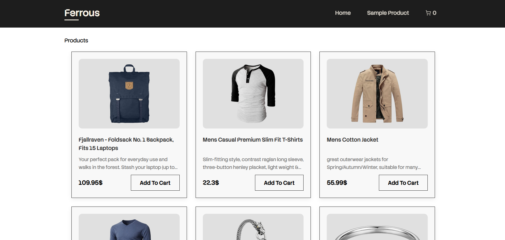

# Project 2: "Ferrous" - A React E-Commerce Store

This project is a complete front-end for a modern e-commerce website, built from the ground up with React. It focuses on practical application of advanced React concepts, including global state management, API data fetching, and multi-page routing.



---

## ✨ Features

* **Multi-Page Routing:** A full site experience using React Router DOM (`/`, `/product`, `/cart`, `/checkout`).
* **API Data Fetching:** Asynchronously fetches product data from the [Fake Store API](https://fakestoreapi.com/).
* **Dynamic Product Pages:** Uses `useSearchParams` to display details for any product ID.
* **Client-Side Pagination:** A custom pagination system on the homepage to browse products.
* **Full-Featured Shopping Cart:** A global cart with complete logic:
    * Add items from the home or details page.
    * Remove items from the cart.
    * Increment / Decrement item quantity.
* **Persistent State:** The cart is saved to `localStorage`, so it persists after a page refresh.
* **Checkout Form:** A complete checkout form with client-side validation for all fields.

---

## 🧠 Key Concepts & Technologies

This project was a deep dive into managing complex, app-wide state and building a real-world application.

### 1. Global State Management (The Cart)

* **`useContext`:** Created a global `CartProvider` to make the cart's data and functions available to any component in the app (like the `Navbar`, `ProductCard`, and `Cart` page).
* **`useReducer`:** Refactored the cart's logic from `useState` to `useReducer` to cleanly manage all the different actions (`ADD_ITEM`, `REMOVE_ITEM`, `INCREMENT_QUANTITY`, `CLEAR_CART`) in one place.
* **`useEffect`:** Used to "listen" for changes to the `cartItems` state and automatically save the new state to `localStorage`.

### 2. Advanced Routing (React Router DOM)

* **`createBrowserRouter` & `<Outlet>`:** Used the modern router setup to create a main layout (`App.jsx`) with a persistent `Navbar` and `Footer`.
* **`useSearchParams`:** To read the product `id` from the URL (`/product/?id=1`) and fetch the correct data.
* **`useNavigate`:** To programmatically send the user back to the home page after successfully placing an order.

### 3. Form Handling & Validation

* **Controlled Components:** Built the checkout form by linking all inputs to a single `useState` object.
* **Client-Side Validation:** Wrote a `validateForm` function to check for empty fields and valid email formats before allowing the form to be submitted, displaying errors to the user.

---

## 🚀 How to Run

1.  **Clone the repository:**
    ```bash
    git clone [YOUR_REPO_URL]
    ```
2.  **Navigate to the folder:**
    ```bash
    cd react-store
    ```
3.  **Install dependencies:**
    ```bash
    npm install
    ```
4.  **Run the app:**
    ```bash
    npm run dev
    ```